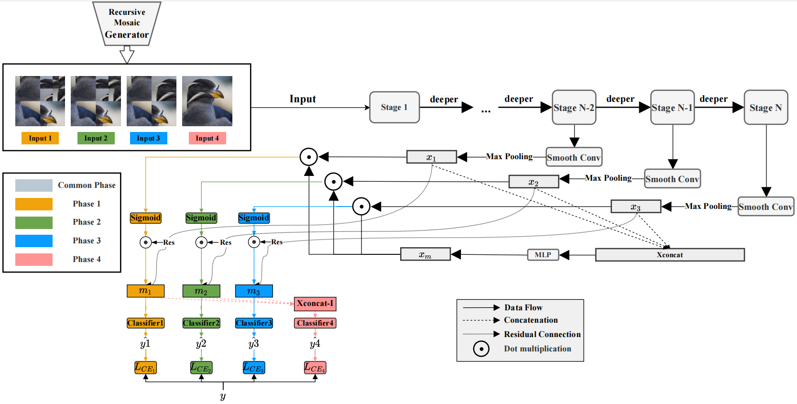

# Progressive Multi-stage Interactive Training in Mobile Network for Fine-grained Visual Classification (BMVC2022)

## Requirement
- python 3.8.5

- PyTorch >= 1.8.0

## Training
- models
    - backbone.py : MobilenetV2_for_PMSI
    - network.py : PMSI
- main.py : You can run this file to train your own model 
- utils.py : Contains some functions including RMG(Recursive_Mosaic_Generator)
    